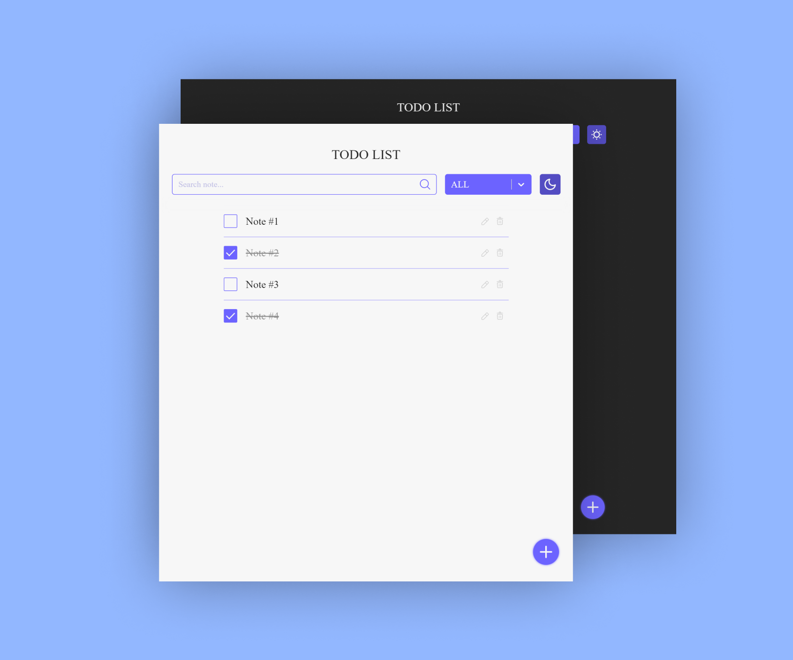

  
  

<h1 align="center">
    Todo React App 📝 
 
</h1>

## 🔑 Features:

- ➕ Add Notes: Quickly add new tasks or notes to your list with ease.
- 🗑️ Delete Notes: Remove completed or unnecessary tasks effortlessly.
- ◀️ Undo Deleted Notes: Restore accidentally deleted tasks with a single tap.
- ✅ Check Notes as Done: Mark tasks as completed to track your progress.
- 🔍 Search Notes: Easily find specific tasks or notes using the search         functionality.
- 📌 Filter Notes: Organize your tasks by completion status, whether complete or incomplete.
- 🌙 Light/Dark Mode Toggle: Switch between light and dark mode for comfortable viewing in any environment.

## 🛠 Installation & Set Up
### To install and run the project locally, follow these steps:

- Clone the repository: git clone https://github.com/IrakliGvelesiani/TodoApp.git
- Navigate to the project directory
- Install the dependencies:  `npm install`
- Start the development server: `npm start`

# Preview

## 🎨 Color Reference

| Color          | Hex                                                                 |
| -------------- | ------------------------------------------------------------------- | 
| Periwinkle Blue   |  `#6C63FF`  |
| Iris          |  `#534CC2`  |
| Whisper          |  `#F7F7F7`  |
| Jet           |  `#252525`  |

